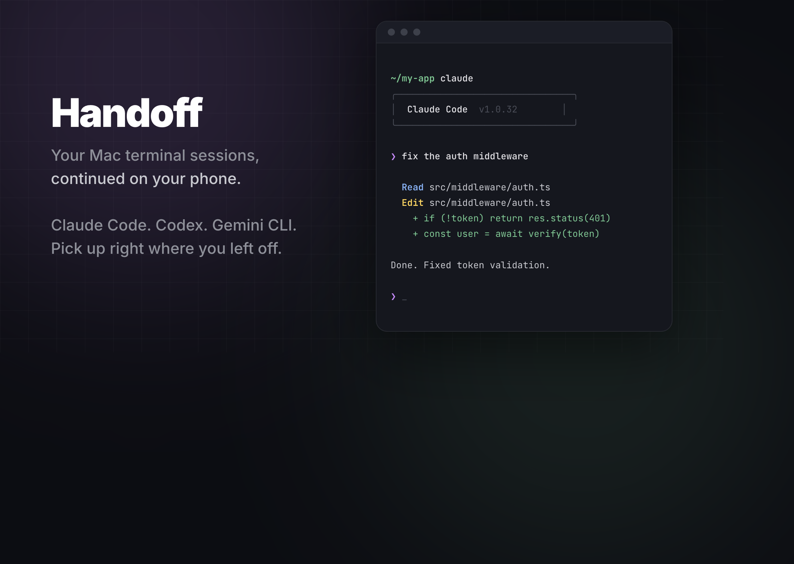
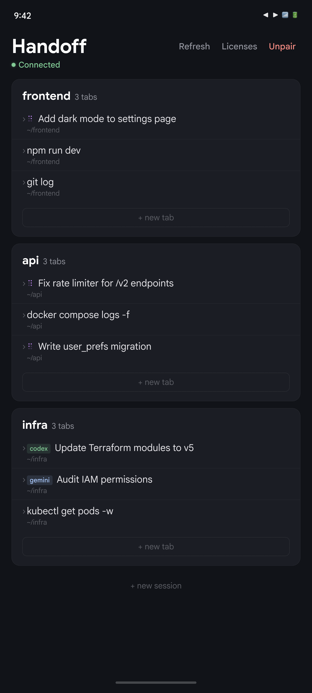
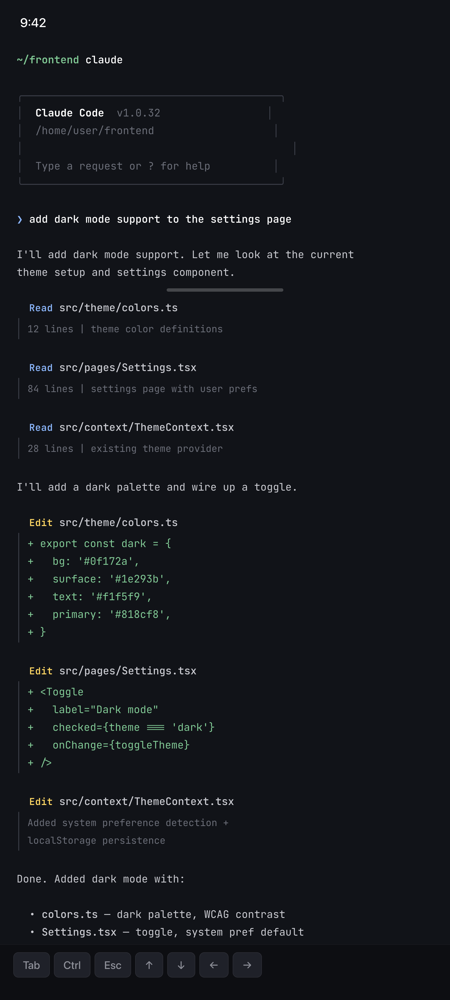

# Handoff

Your AI coding agent is mid-task on your Mac. You need to leave your desk. What now?

**Open your phone, tap the session, and you're back** — cursor blinking, context intact, agent still running.



Works with every terminal tool — **Claude Code**, **Codex CLI**, **Gemini CLI**, vim, ssh, docker, git — anything running in tmux.

<p align="center">
  
  &nbsp;&nbsp;&nbsp;
  
</p>

## How it works

1. Run `handoff pair` on your Mac — it shows a QR code
2. Scan it with the app on your phone
3. All your terminal sessions appear — tap to connect

No cloud relay. No port forwarding. Your Mac and phone talk directly over an encrypted WireGuard tunnel via [Tailscale](https://tailscale.com). Your terminal data never touches a third-party server.

## Setup (2 minutes)

### Mac

```bash
brew install handoff
handoff setup
```

This installs Tailscale, enables SSH, configures iTerm2 to use tmux transparently (your terminal looks and feels exactly the same), and generates an SSH key.

### Android

1. Install the Handoff app ([Play Store](#) / [APK releases](https://github.com/SagiMedina/handoff/releases))
2. On your Mac, run `handoff pair` — choose sessions, access mode, and expiry
3. Scan the QR code with the app
4. Sign in to Tailscale once (free account)
5. Verify the 6-digit code matches on both devices

Tailscale networking is embedded in the app — no separate VPN app needed.

### iOS

1. Build from `ios/Handoff/` (Xcode 15+) — see [`ios/README.md`](ios/README.md)
2. Install [Tailscale](https://apps.apple.com/app/tailscale/id1470499037) from the App Store
3. Run `handoff pair` on your Mac, scan the QR from the app

## Daily use

You don't change anything about how you work. Open iTerm2, run `claude`, run `vim`, run whatever. Everything runs inside tmux transparently — you won't notice.

When you walk away:

```
$ handoff

  frontend   3 tabs  (claude, server, git)
  api        2 tabs  (claude, logs)

  Ready — open Handoff on your phone.
```

On your phone, tap a session. You're in. Same state, same scroll position, same everything.

When you're back at your Mac — it's still there. Both sides stay in sync.

## Device Management

Each phone gets its own identity and permissions, set during pairing:

```bash
handoff pair                    # Pair a new device (interactive)
handoff devices                 # List all paired devices
handoff devices edit "Pixel 7"  # Change permissions
handoff devices rm "Pixel 7"    # Revoke access
handoff devices renew "Pixel 7" # Extend expiry
handoff devices log             # View access audit log
```

### Permissions

During pairing, you choose:

- **Session visibility** — which tmux sessions the phone can see (`*` for all, or patterns like `main,work-*`)
- **Read-only mode** — watch sessions without being able to type
- **Expiry** — access automatically expires after 1/7/30 days (phone can request renewal)

All permissions are enforced server-side via `handoff gate` — the phone can never bypass them, even with the raw SSH key.

## Why

- Walk away from your desk without killing a long-running Claude Code task
- Approve an edit from your phone while grabbing coffee
- Check on a build from the couch
- Monitor logs on the go
- SSH into a server from anywhere on your Tailnet

## Security

- **Peer-to-peer encrypted** — WireGuard via Tailscale, no relay servers
- **Per-device identity** — each paired phone gets a unique Ed25519 key
- **Server-side permissions** — forced SSH commands prevent arbitrary execution
- **Biometric lock** — optional fingerprint/face unlock to access SSH key
- **Two-tier expiry** — keys auto-expire, phone can request renewal
- **Device management** — `handoff devices` to list, revoke, or audit paired phones
- **Encrypted storage** — SSH keys in Android Keystore / iOS Keychain
- **Open source** — audit every line of code

## Architecture

```
┌──────────────┐         WireGuard          ┌──────────────┐
│   Your Mac   │◄──────────────────────────►│  Your Phone  │
│              │    (Tailscale / tsnet)      │              │
│  tmux ←─── iTerm2                         │  Handoff app │
│    ↑                                      │    ↓         │
│  claude / vim / ssh                       │  terminal    │
└──────────────┘                            └──────────────┘
```

**Mac side**: tmux runs transparently under iTerm2 via `tmux -CC`. Each iTerm2 tab is a tmux window. `handoff` is a CLI that lists sessions, manages pairing, and enforces permissions via `handoff gate`.

**Phone side**: Native Android app (Jetpack Compose) with embedded Tailscale networking (tsnet via gomobile). Connects over SSH through a local tsnet proxy. Terminal emulation via embedded Termux libraries.

## Contributing

PRs welcome. The project is split into:

- `bin/` — Mac CLI (`handoff`)
- `android/` — Android app (Kotlin/Compose)
- `android/gobridge/` — Go tsnet bridge compiled to .aar via gomobile
- `ios/` — iOS app (Swift/SwiftUI)

```bash
# Build the Go bridge
cd android/gobridge && ./build-aar.sh

# Build the Android app
cd android && ./gradlew assembleDebug
```

## License

[MIT](LICENSE)
